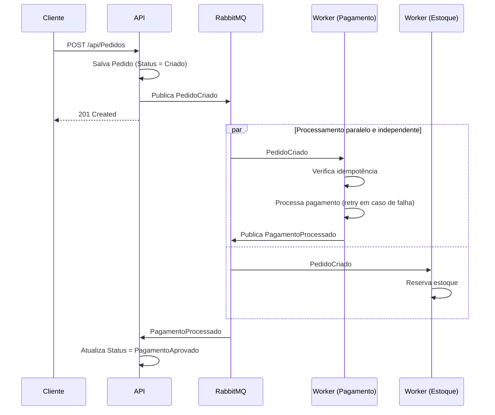

# Projeto Fila de Jobs — Processamento Assíncrono de Pedidos

Sistema de processamento de pedidos construído para demonstrar conceitos avançados de back-end:
processamento assíncrono, mensageria, múltiplos workers independentes, retries, dead-letter queue,
idempotência e coreografia de eventos.

A API recebe um pedido, persiste no banco e publica um evento. A partir daí, processos
independentes (workers) reagem a esse evento de forma assíncrona e paralela — sem que o cliente
precise esperar o processamento completo terminar.

## Stack técnica

| Camada | Tecnologia |
|---|---|
| Linguagem / Framework | C# / ASP.NET Core (.NET 10) |
| Banco de dados | PostgreSQL |
| ORM | Entity Framework Core |
| Mensageria | RabbitMQ |
| Abstração de mensageria | MassTransit |
| Containerização | Docker / Docker Compose |
| Documentação de API | Swagger (Swashbuckle) |

## Arquitetura

O projeto é dividido em três projetos independentes na mesma solution:

```
Solution
 ├─ Projeto Fila de Jobs           → API (Controllers, EF Core, Services)
 ├─ ProjetoFilaDeJobs.Worker       → Worker Service (Consumers)
 └─ ProjetoFilaDeJobs.Contracts    → Eventos compartilhados entre API e Worker
```

**API** e **Worker** rodam como processos separados, cada um com seu próprio `DbContext` e sua
própria conexão com o Postgres — nenhum dos dois acessa diretamente tabelas que não são de sua
responsabilidade. A comunicação entre eles acontece **somente via eventos publicados no RabbitMQ**,
nunca por acesso direto a banco de dados entre os dois processos.

### Fluxo de eventos (coreografia)



Não existe um "orquestrador" central dizendo o que cada serviço deve fazer — cada um reage a
eventos de forma independente. Esse padrão é chamado de **coreografia de eventos**.

## Conceitos de back-end demonstrados

- **Processamento assíncrono** — a API responde ao cliente sem esperar o processamento pesado terminar
- **Múltiplos consumers independentes** — dois workers (`PedidoCriadoConsumer` e `EstoqueConsumer`)
  reagem ao mesmo evento em paralelo, sem um saber da existência do outro
- **Retry com backoff** — falhas transitórias são automaticamente re-tentadas antes de desistir
- **Dead-letter queue** — mensagens que esgotam as tentativas de retry são movidas para uma fila de
  erro, disponíveis para inspeção, em vez de simplesmente descartadas
- **Idempotência** — cada evento só produz efeito uma única vez, mesmo se a mensagem for entregue
  mais de uma vez (controlado por uma tabela própria do Worker)
- **Coreografia de eventos** — serviços se comunicam via eventos, nunca acessando diretamente o
  banco de dados um do outro
- **Arquitetura em camadas** — Controller → Service → `DbContext`, com responsabilidades bem
  definidas em cada nível
- **DTOs desacoplados de entidades** — contratos de entrada, saída e de mensageria são todos
  diferentes entre si, cada um evoluindo por seus próprios motivos

## Estrutura de pastas (API)

```
Projeto Fila de Jobs/
 ├─ Controllers/       → endpoints HTTP (PedidosController)
 ├─ Consumers/         → consumers da própria API (PagamentoProcessadoConsumer)
 ├─ Services/          → regra de negócio (IPedidoService / PedidoService)
 ├─ Data/              → AppDbContext e configuração do EF Core
 ├─ Models/            → entidades (Pedido, ItemPedido)
 └─ DTOs/              → contratos de entrada e saída da API
```

## Estrutura de pastas (Worker)

```
ProjetoFilaDeJobs.Worker/
 ├─ Consumers/         → PedidoCriadoConsumer (pagamento), EstoqueConsumer
 ├─ Data/              → WorkerDbContext (tabela própria de idempotência)
 └─ Models/            → ProcessamentoPedido (controle de idempotência)
```

## Como rodar localmente

### Pré-requisitos

- [.NET 10 SDK](https://dotnet.microsoft.com/download)
- [Docker Desktop](https://www.docker.com/products/docker-desktop/)

### 1. Subir a infraestrutura (Postgres + RabbitMQ)

Na raiz do repositório:

```bash
docker compose up -d
```

Isso sobe o PostgreSQL (porta `5432`) e o RabbitMQ, com painel de gerenciamento disponível em
`http://localhost:15672` (usuário `admin`, senha `admin123`).

### 2. Configurar as connection strings

Cada projeto (API e Worker) usa **User Secrets** para a connection string, para não expor
credenciais no repositório:

```bash
cd "Projeto Fila de Jobs"
dotnet user-secrets set "ConnectionStrings:DefaultConnection" "Host=localhost;Port=5432;Database=pedidos_db;Username=admin;Password=admin123"
cd ..

cd ProjetoFilaDeJobs.Worker
dotnet user-secrets set "ConnectionStrings:DefaultConnection" "Host=localhost;Port=5432;Database=pedidos_db;Username=admin;Password=admin123"
cd ..
```

### 3. Aplicar as migrations

```bash
dotnet ef database update --project "Projeto Fila de Jobs/Projeto Fila de Jobs.csproj"
dotnet ef database update --project "ProjetoFilaDeJobs.Worker/ProjetoFilaDeJobs.Worker.csproj"
```

### 4. Rodar API e Worker

No Visual Studio, configure **múltiplos projetos de inicialização** (botão direito na Solution →
Configure Startup Projects → Multiple startup projects → marque `Projeto Fila de Jobs` e
`ProjetoFilaDeJobs.Worker` como "Start"), e aperte **F5**.

Ou, via terminal, em duas janelas separadas:

```bash
dotnet run --project "Projeto Fila de Jobs/Projeto Fila de Jobs.csproj"
dotnet run --project "ProjetoFilaDeJobs.Worker/ProjetoFilaDeJobs.Worker.csproj"
```

A API sobe com Swagger disponível em `https://localhost:{porta}/swagger`.

## Endpoints da API

| Método | Rota | Descrição |
|---|---|---|
| `POST` | `/api/Pedidos` | Cria um novo pedido e publica o evento `PedidoCriado` |
| `GET` | `/api/Pedidos/{id}` | Retorna um pedido pelo `id`, incluindo seus itens |

### Exemplo de requisição

```json
POST /api/Pedidos
{
  "clienteNome": "João Silva",
  "clienteEmail": "joao@email.com",
  "itens": [
    { "produtoNome": "Teclado Mecânico", "quantidade": 1, "precoUnitario": 350.00 }
  ]
}
```

## Eventos (contratos compartilhados)

| Evento | Publicado por | Consumido por | Descrição |
|---|---|---|---|
| `PedidoCriado` | API | Worker (pagamento e estoque) | Disparado após o pedido ser persistido |
| `PagamentoProcessado` | Worker | API | Disparado após o processamento do pagamento ter sucesso |

## Decisões de arquitetura relevantes

- **Sem camada de `Repository` sobre o EF Core** — o `DbContext`/`DbSet<T>` já funciona como uma
  abstração de acesso a dados; uma camada extra que só delegasse para ele seria redundante.
- **Worker com `DbContext` próprio** — em vez de referenciar o projeto da API, o Worker gerencia
  seus próprios dados (tabela de idempotência), evitando acoplamento entre os dois processos.
- **Atualização de status via evento, não via escrita direta** — o Worker nunca escreve na tabela
  `Pedidos`; ele publica um evento, e é a própria API quem decide como reagir a ele.
- **DTOs como `record`, entidades como `class`** — DTOs representam dados imutáveis que trafegam;
  entidades precisam ser mutáveis para o *change tracking* do EF Core funcionar.
- **Falha simulada no Consumer de pagamento** — propositalmente, para tornar o retry e a
  dead-letter queue observáveis em testes manuais (uma chamada real a um gateway de pagamento
  entraria nesse lugar).

## Possíveis evoluções futuras

- Worker de envio de e-mail como terceiro consumer independente
- Dashboard simples para visualizar o status dos pedidos e mensagens na dead-letter queue
- Testes automatizados (unitários para os Services, de integração para os Consumers)
- Autenticação/autorização na API (JWT)
- Observabilidade (logs estruturados, métricas, tracing distribuído)
